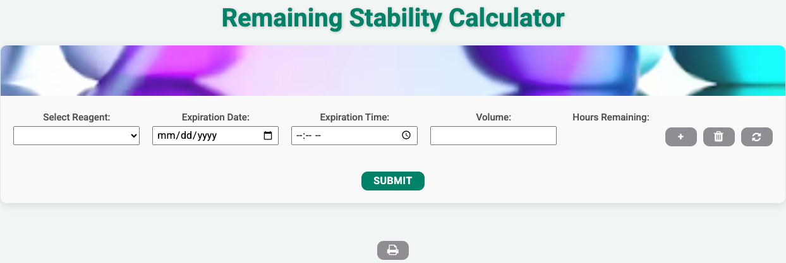

# Reagent Stability Calculator

A dynamic web application for calculating the remaining stability of laboratory reagents. This project demonstrates DOM manipulation, event handling, and print-ready report formatting with CSS.  

## Features

- **Dynamic Rows**: Add or remove reagent entries using the Add (+) and Delete (trash) buttons.  
- **Row-Specific Reset**: Clear input fields and output for a single row without affecting other rows.  
- **Remaining Hours Calculation**: Submit button calculates remaining stability hours for each reagent based on expiration date and time.  
- **Print-Friendly Report**: Print button opens the printer dialog and generates a clean, professional report:  
  - Zebra striping on alternate rows for readability  
  - Buttons and images hidden in print view  
  - Landscape orientation for better layout  

## Technologies Used

- **HTML5**: Structure of the form and report  
- **CSS3**: Styling, responsive layout, and print media query  
- **JavaScript (ES6)**: Dynamic row manipulation, calculations, and event handling  

## Usage

1. Clone the repository:  
   ```bash
   git clone https://github.com/BenjChristiansen/remaining-stability-calculator.git
Open index.html in a browser.

Add, remove, or reset reagent entries as needed.

Click Submit to calculate remaining stability hours.

Click Print to generate a formatted report.

Screenshots



License
This project is open-source and free to use.