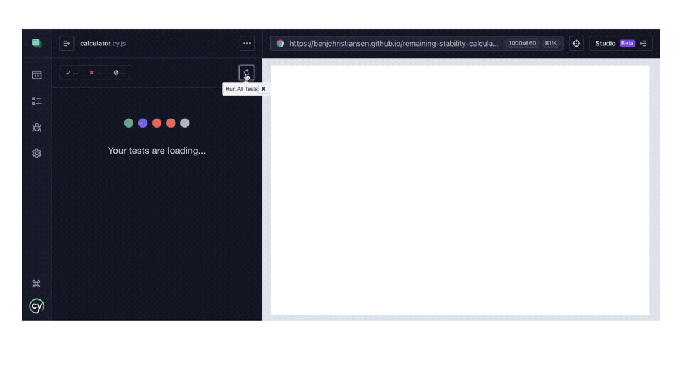
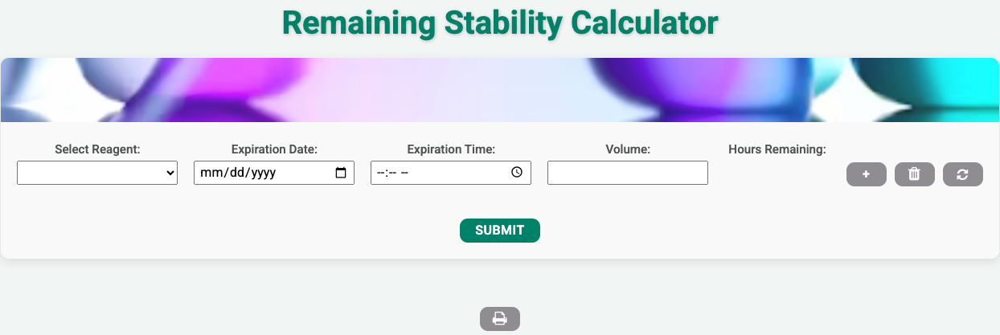

# Reagent Stability Calculator

A dynamic web application for calculating the remaining stability of laboratory reagents. This project demonstrates DOM manipulation, event handling, and print-ready report formatting with CSS.  

## Live Demo

🔗 [Open the Calculator](https://benjchristiansen.github.io/remaining-stability-calculator/)

## Features

- **Dynamic Rows**: Add or remove reagent entries using the Add (+) and Delete (trash) buttons.  
- **Row-Specific Reset**: Clear input fields and output for a single row without affecting other rows.  
- **Remaining Hours Calculation**: Submit button calculates remaining stability hours for each reagent based on expiration date and time.  
- **Print-Friendly Report**: Print button opens the printer dialog and generates a clean, professional report:  
  - Zebra striping on alternate rows for readability  
  - Buttons and images hidden in print view  
  - Landscape orientation for better layout  

## Technologies Used

- **HTML5**: Structure of the form and report  
- **CSS3**: Styling, responsive layout, and print media query  
- **JavaScript (ES6)**: Dynamic row manipulation, calculations, and event handling  
- **Cypress**: End-to-end testing for calculator functionality

### Remaining Stability Calculator Demo



## Usage

1. Clone the repository:  
   ```bash
   git clone https://github.com/BenjChristiansen/remaining-stability-calculator.git
Open index.html in a browser.

Add, remove, or reset reagent entries as needed.

Click Submit to calculate remaining stability hours.

Click Print to generate a formatted report.

## Testing

This project includes Cypress tests to verify core functionality:

Page Load: Ensures the calculator page loads and required elements exist.

Basic Calculation: Fills in reagent, expiration date, and time, then submits to check for visible results.

Edge Cases: Handles past and future expiration dates, ensuring the application responds correctly.

Run tests:

# Open Cypress Test Runner
npx cypress open

# Or run headless with video recording
npx cypress run --spec "cypress/e2e/calculator.cy.js"


## Screenshots


## Project Case Study
📄 
The case study documents the full development process, including:
* workflow analysis with MLS staff
* UI design and iteration
* JavaScript calculation logic
* automated testing with Cypress

License
This project is open-source and free to use.